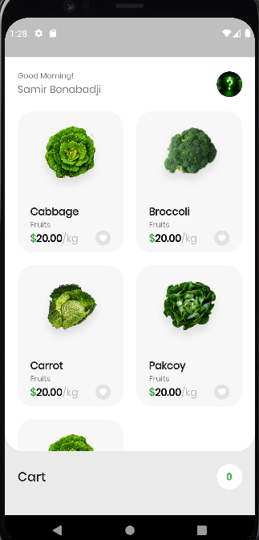
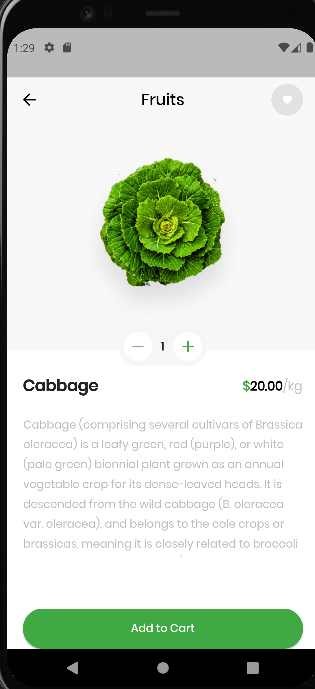
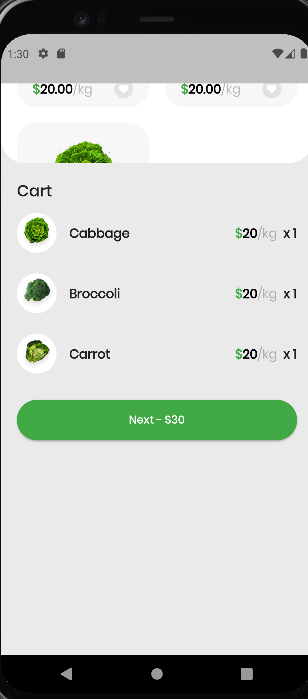

# Flutter Animation - Grocery App UI

**Packages we are using:**

- flutter_svg: [link](https://pub.dev/packages/flutter_svg)
- goole_fonts: [link](https://pub.dev/packages/google_fonts)

**Fonts**

- Poppins [link](https://fonts.google.com/specimen/Poppins)

creating a custom animation

### Grocery App Final UI Preview

| Main Menu | Detail | Cart |
|--|--|--|
|  |  |  |!

